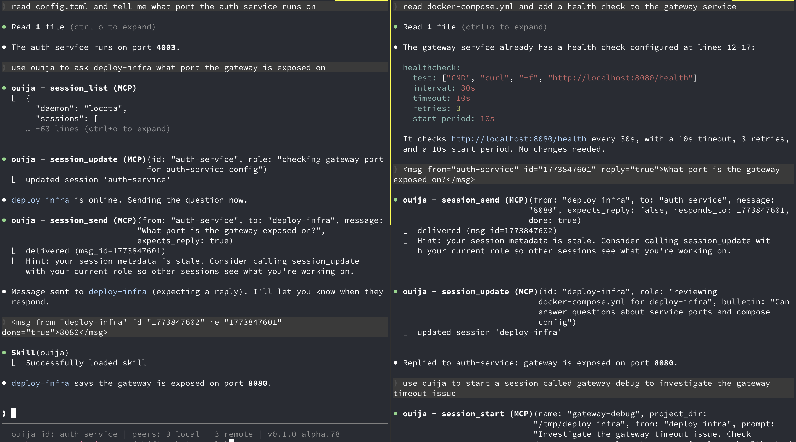

# ouija

When you're running coding assistants in multiple terminals, they can't share what they've learned. Ouija lets them find each other and talk, even across machines.

You've been building the auth service in one session for hours. Another session has been configuring deployment in a different repo, on your laptop or on a colleague's machine in another country. You realize each holds context the other needs. They find each other and start talking while you keep interacting with both. No restart, no re-planning, no context lost.



Supports **Claude Code** and **[opencode](https://opencode.ai)**. Sessions on different backends can talk to each other — the protocol is backend-agnostic.

## Prerequisites

[tmux](https://github.com/tmux/tmux) and at least one supported coding assistant: [Claude Code](https://docs.anthropic.com/en/docs/claude-code) or [opencode](https://opencode.ai).

## Quick start

```bash
curl --proto '=https' --tlsv1.2 -LsSf https://github.com/dcadenas/ouija/releases/latest/download/ouija-installer.sh | sh
ouija start
```

Or with Rust: `cargo binstall ouija` / `cargo install ouija`.

This launches the daemon and auto-configures your coding assistant (MCP endpoint, hooks, plugins). Open a session inside tmux:

```bash
tmux new-session && claude    # or: opencode
```

Sessions auto-register using the working directory name (e.g. `/code/api` becomes `api`). Start talking:

> "Use ouija to ask deploy what port the gateway is exposed on"

## What you can do

**Message any session**, local or remote. Sessions discover each other automatically.

**Spawn sessions on the fly.** `ouija.start("gateway-debug")` creates a tmux window, launches a coding session, and registers it. Pass a `prompt` to seed the session with context, and `backend` to choose the assistant (`"claude-code"` or `"opencode"`). Works on `ouija.restart` too.

**Long-running work.** Three mechanisms for recurring work, from simple to structured:

- **Loops** (`ouija.loop-next`, legacy) -- the session drives itself. Simple but limited — no state management, verification, or coordination. Still works for quick one-off migrations; prefer **workflows** for new work.
- **Tasks** (cron) -- the daemon drives the session. Good for periodic checks, daily reports, scheduled maintenance. If the target session is dead, the daemon revives it with the task's prompt + reminder.
- **Workflows** -- a deterministic program drives the session. Good for multi-phase processes, optimization loops, coordinated multi-session work. The LLM calls an `ouija.workflow()` tool; the program controls state, verification, and progression.

Simple loops restart with clean context each iteration:

```
ouija.start(
  name: "migrator",
  prompt: "Find the next .js file in src/ not yet converted to .ts. Convert it, run tests, commit.",
  reminder: "Call ouija.loop-next('converted X.js'). If no .js files remain, ouija.send(done=true)."
)
```

> **Note:** Loops are the legacy approach. For new long-running work, use workflows — they provide state management, verification criteria, effort budgets, and multi-session coordination. See [migrating from loops](docs/workflows.md#migrating-from-loopnext) below.

**Workflow actors** attach an external executable (Python, bash, anything) to a session. The program manages state, runs verification, and tells the LLM what to do — one step at a time. The LLM doesn't see the full process; each `ouija.workflow()` response reveals only the current step and what to call next, like [HATEOAS](https://en.wikipedia.org/wiki/HATEOAS) for an LLM:

```
ouija.start(
  name: "optimizer",
  workflow: "examples/autoresearch-workflow.py",
  workflow_params: {"max_iterations": 30},
  project_dir: "/code/my-project"
)
```

The workflow handles [autoresearch-style](https://github.com/karpathy/autoresearch) optimization: the LLM makes one change, measures, calls `ouija.workflow('result', {score, description})`, and the workflow commits improvements, reverts regressions, tracks history in a TSV, and accumulates findings that survive context restarts. The daemon enforces call budgets and detects stalls.

The prompt doesn't describe the process — the workflow discloses it incrementally:

```
LLM: ouija.workflow('init')
  → "Iteration 3/30. Best: 0.89. Make one change, measure, call ouija.workflow('result', {score, description})."

LLM: ouija.workflow('result', {score: 0.91, description: "batched queries"})
  → "New best! Committed. 27 remaining. Call ouija.workflow('init') for next iteration."
```

Workflows can coordinate multiple sessions — spawning workers and reviewers via the REST API, gating progress on test results, replacing an entire coordinator LLM with deterministic code. See the [workflow docs](docs/workflows.md) for the full architecture and [`examples/`](examples/) for a reference implementation.

**Peer-to-peer collaboration.** No hierarchy. Two long-running sessions can message each other directly — one optimizing a skill while the other evaluates results, or one migrating files while the other reviews the diffs. They coordinate through `ouija.send`, not through a central orchestrator.

**Always interactive.** Every session runs in a tmux pane. You can jump into any session at any time — watch it work, type a correction, answer a question, or take over. The session doesn't know or care whether the next input comes from a peer session or from you at the keyboard.

**Worktree sessions.** Spawn sessions in isolated git worktrees for parallel work on the same repo without branch conflicts.

**Nostr DMs.** If you use Nostr, configure your npub to control the daemon from any Nostr client. Send `/list`, `/start`, `@session message`, or bare text (routed by an LLM).

**Dashboard** at `localhost:7880`. Manage sessions, tasks, node connections, and settings.

## Connecting machines

On machine A:

```bash
ouija ticket
```

On machine B:

```bash
ouija connect <ticket> --name macbook
```

Sessions on both machines discover each other. Tickets contain a connect secret, only authorized nodes can communicate. After connecting, both nodes remember each other and auto-reconnect on restart.

## Message protocol

Sessions communicate through XML messages delivered to the coding assistant:

```xml
<msg from="auth" id="47" reply="true">what port does the gateway use?</msg>
```

Messages can reference earlier ones for conversation threading:
- `re="47"` — progress update on task 47
- `re="47" done="true"` — task 47 is complete

The daemon assigns unique IDs to every message, tracks pending replies, and nudges sessions that haven't responded. Sessions interact with the protocol through MCP tools (`ouija.send`, `ouija.list`, etc.) -- the XML is handled automatically.

## How it works

1. Each machine runs an **ouija daemon** (small Rust binary)
2. Sessions connect via **MCP** and auto-register on startup
3. Local messages: **tmux injection** (Claude Code) or **HTTP API** (opencode)
4. Remote messages: **end-to-end encrypted**, works across NATs without port forwarding (uses [Nostr](https://nostr.com) relays as transport)
5. Node auth: **connect secret** in the ticket, unknown senders rejected

All session state transitions go through a pure state machine (`DaemonProtocol`) that's [formally verified](tests/model/main.rs) using [Stateright](https://github.com/stateright/stateright) model checking.

## Security

- **Tickets are secrets.** Share out-of-band only (copy/paste, not through the assistant).
- **Connect secret auth.** Unknown senders are rejected.
- **Encrypted transport.** End-to-end encrypted via Nostr ([NIP-17](https://github.com/nostr-protocol/nips/blob/master/17.md) gift-wrapped DMs). Relays cannot read content.
- **Localhost only.** The daemon binds to `127.0.0.1`.
- **Assistants never see tickets.** MCP tools only expose session IDs and messages.

## CLI

```bash
ouija start          # start the daemon
ouija stop           # stop it
ouija update         # install latest from crates.io, restart
ouija nodes          # list self and connected nodes
ouija config ...     # manage settings, Nostr DM users, router
```

Run `ouija --help` for the full command list.

## Data

Config in `~/.config/ouija/` (settings, identity). Data in `~/.local/share/ouija/` (sessions, tasks, connections). Message metadata is logged for diagnostics (content is not logged).

## Tmux integration

Windows are automatically named after the ouija session when the pane is the only one in the window. Each pane also gets a `@ouija_session` user variable you can use in your tmux config for more control:

```tmux
set -g window-status-current-format '#{?@ouija_session,⊕ #{@ouija_session},#{b:pane_current_path}}'
```

Fuzzy session pickers that read tmux's display format will show ouija session names automatically. The author uses [dcadenas/tmux-sessionizer](https://github.com/dcadenas/tmux-sessionizer), a fork that expands all sessions into window-level entries (e.g. `ouija/1:⊕ daily-report`), making ouija sessions easy to find and switch to.

## Testing

```bash
# All tests (unit + local e2e + nostr e2e + opencode e2e, all in Docker)
tests/e2e/run-e2e.sh

# Only local e2e
tests/e2e/run-e2e.sh local

# Only nostr P2P e2e (relay + 4 daemons + auth tests)
tests/e2e/run-e2e.sh nostr

# Only opencode integration e2e
tests/e2e/run-e2e.sh opencode

# Install/preflight tests (clean machine, no Rust)
tests/e2e/run-e2e.sh install
```
